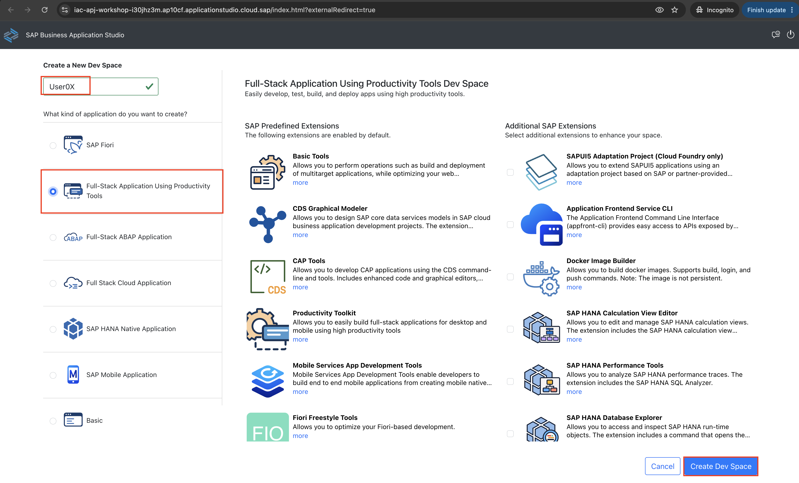
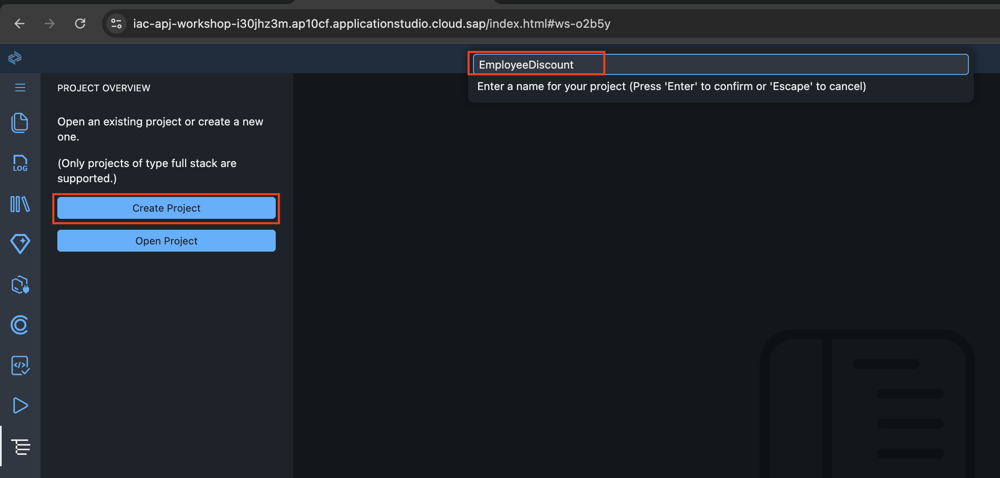
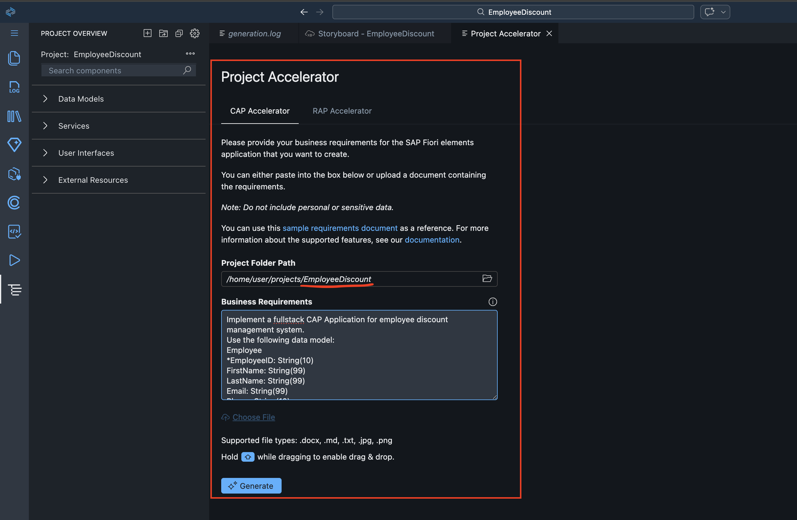
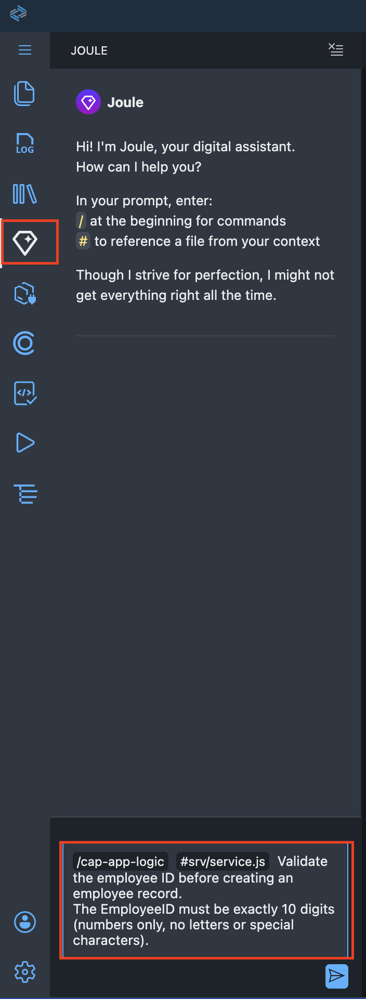

# Exercise 1: Generate a Full-Stack CAP Application Using Joule 💎

## Introduction

In this exercise, you will use **Joule for Developers 💎** inside SAP Business Application Studio (BAS) to generate a full-stack **CAP (Cloud Application Programming model)** application with a Fiori Elements UI — from a single natural language prompt.

The application you will generate is an **Employee Discount Management System**. It allows employees to view and request discount cards, while administrators manage offers, approve requests, and handle reporting.

By the end of this exercise, you will have:
- A CAP application with a CDS data model, OData service, and Fiori Elements UI
- Auto-generated test data
- Custom validation logic added through Joule

### Exercises

- [1.1 - Create the project in BAS](#exercise-11-create-the-project-in-bas)
- [1.2 - Generate the application with Joule](#exercise-12-generate-the-application-with-joule)
- [1.3 - Preview the application locally](#exercise-13-preview-the-application-locally)
- [1.4 - Add custom logic](#exercise-14-add-custom-logic)
- [1.5 - Regenerate test data](#exercise-15-regenerate-test-data)
- [Summary & Next exercise](#summary--next-exercise)

---

## Exercise 1.1: Create the project in BAS

[^Top of page](#introduction)

> Open SAP Business Application Studio and set up a workspace for the exercise.

<details>
  <summary>🔵 Click to expand!</summary>

1. Open **SAP Business Application Studio (BAS)**

2. Create a new dev space with the following details, then click **Create Dev Space**:

   | Field | Value |
   |-------|-------|
   | Name | `USERXX` |
   | App Type | **Full-Stack Application Using Productivity Tools** |

   
   
2. Open the created dev space.

3. From the **Welcome** screen, click **Create Project** and name the project **`EmployeeDiscount`**.

   

   > ℹ️ **Tip:** You can also open a terminal (`Ctrl + ~` / `Cmd + ~`) and run:
   > ```sh
   > mkdir EmployeeDiscount && cd EmployeeDiscount
   > ```

4. Once the project is created, open it in the editor.

</details>

---

## Exercise 1.2: Generate the application with Joule

[^Top of page](#introduction)

> Use the **Fiori: Project Accelerator** powered by Joule 💎 to generate the full-stack CAP application from a natural language prompt.

<details>
  <summary>🔵 Click to expand!</summary>

1. Open the **Command Palette**:
   - **Windows / Linux:** `Ctrl + Shift + P`
   - **Mac:** `Cmd + Shift + P`

2. Type **`Fiori: Project Accelerator`** and select it from the list.

   

3. Copy and paste the prompt below into the chat input, then press **Enter**:

   ```prompt
   Implement a fullstack CAP Application for employee discount management system.

   Use the following data model:

   Employee
   *EmployeeID: String(10)
   FirstName: String(99)
   LastName: String(99)
   Email: String(99)
   Phone: String(10)
   Role: String(4)
   DateOfBirth: Date
   DateOfJoining: Date
   HireDate: Date
   Department: String(4)
   Org: String(6)
   ManagerID: String(10)
   EligibilityStatus: Boolean

   Workplace
   *WorkplaceID: String(10)
   WorkplaceName: String(99)
   Region: String(4)
   Country: Country
   City: String(99)
   PIN: String(6)
   CorrespondenceAddress: AddressType
   Brand: String(4)
   CountryHeadID: String(10)

   Partner
   *PartnerID: String(10)
   FirstName: String(99)
   LastName: String(99)
   Type(Husband,Wife): String(2)
   DateOfBirth: Date
   Status: Boolean
   Phone: String(10)
   Email: String(99)
   RelationshipProof: Boolean
   CardID: String(25)

   Card
   *CardNumber: String(25)
   CardName: String(99)
   CardType: String(2)
   IssueDate: Date
   ExpiryDate: Date
   Limit: Integer
   Status: Boolean
   IssuedBy: String(10)
   Currency: Currency

   Offers
   *OfferID: String(10)
   OfferText: String(255)
   ValidFrom: Date
   ValidTo: Date
   Status: Boolean
   ApplicableCategories: String(4)
   DiscountPercent: Integer

   Associations:
   Employee  → Workplace  (Many-to-One)
   Employee  → Card       (One-to-One)
   Employee  → Partner    (One-to-One)
   Card      → Offers     (Many-to-Many)
   Workplace → Offers     (One-to-Many)

   (* = key field)
   ```

4. Joule will generate the following artifacts automatically:

   | Artifact | Location | Purpose |
   |---|---|---|
   | CDS data model | `db/schema.cds` | Entities and associations |
   | OData service | `srv/service.cds` | Exposes entities via OData V4 |
   | Fiori Elements UI | `app/` | List Report + Object Page |
   | Test data | `db/data/*.csv` | Sample records per entity |
   | Project config | `package.json` | CAP dependencies and scripts |

   > ℹ️ **Note:** Generation may take a minute. Artifact names may differ slightly from those shown here — this is expected for GenAI-based generation.

5. Once generation is complete, verify the folder structure in the Explorer panel:

   ```
   EmployeeDiscount/
   ├── app/            ← Fiori Elements UI
   ├── db/
   │   ├── schema.cds  ← CDS data model
   │   └── data/       ← Test data CSV files
   ├── srv/
   │   └── service.cds ← OData service definition
   └── package.json
   ```

</details>

---

## Exercise 1.3: Preview the application locally

[^Top of page](#introduction)

> Run the CAP application locally and open the Fiori Elements preview to verify the generated UI and data.

<details>
  <summary>🔵 Click to expand!</summary>

1. Open the **Run and Debug** panel:
   - Click the bug icon ( 🐛 ) in the left sidebar, or press `Ctrl + Shift + D` / `Cmd + Shift + D`.

2. Click the green **▶ Start Debugging** button. BAS will start the CAP server.

   > ℹ️ **Note:** The first startup may take a moment while `npm install` runs in the background.

3. Once the server is running, the **Application Preview** opens on the right side. Click on the **Fiori Elements** tile for the **Employee** entity.

4. A Fiori Elements **List Report** opens in the browser with test data pre-loaded from the generated CSV files.

   > ✅ **Expected result:** The Employee list displays with all columns from the data model and no errors in the browser console.

</details>

---

## Exercise 1.4: Add custom logic

[^Top of page](#introduction)

> Use the Joule `/cap-app-logic` annotation to add server-side validation: `EmployeeID` must be a 10-digit number (digits only).

<details>
  <summary>🔵 Click to expand!</summary>

> ℹ️ **Note:** The `/cap-app-logic` option only appears in Joule when a `.js` service handler file exists in the `srv/` folder. Complete step 1 first if you do not see it.

1. In the Explorer, right-click on the **`srv/`** folder and select **New File**. Name it **`service.js`**.

   This file acts as the CAP service handler. Creating it activates the `/cap-app-logic` annotation in Joule.

2. Open **Joule 💎** by clicking its icon in the sidebar, or via the Command Palette: `Joule: Open`.

3. Select the **`/cap-app-logic`** annotation and paste the following prompt:

   ```prompt
   Validate the employee ID before creating an employee record.
   The EmployeeID must be exactly 10 digits (numbers only, no letters or special characters).
   ```

4. Joule will generate a `before CREATE` handler with the validation. Review the code and click **Accept**.

5. Stop and restart the application from the Debug panel, then test the validation:
   - **Invalid:** Try creating an employee with ID `EMP001` — the request should be rejected with an error message.
   - **Valid:** Try creating one with ID `9900000001` — it should be saved successfully.


   

</details>

---

## Exercise 1.5: Regenerate test data

[^Top of page](#introduction)

> The original test data contains non-numeric `EmployeeID` values that now fail the validation. Use Joule to regenerate it with valid IDs.

<details>
  <summary>🔵 Click to expand!</summary>

1. Open **Joule 💎** and select the **`/cap-data-gen`** annotation.

2. Paste the following prompt:

   ```prompt
   Regenerate the Employee test data.
   The EmployeeID must be exactly 10 digits.
   Start employee numbers from 99, for example: 9900000001, 9900000002, and so on.
   ```

3. Joule will update the Employee CSV file in `db/data/`. Review the changes and click **Accept**.

4. Restart the application and verify:
   - The Employee list loads without errors.
   - All `EmployeeID` values in the list are 10-digit numbers.

   > ✅ **Expected result:** All test employees display with valid numeric IDs and no validation errors are triggered on existing data.

</details>

---

## Summary & Next exercise

[^Top of page](#introduction)

Congratulations! In this exercise you used **Joule for Developers 💎** to:

- Generate a full-stack **CAP application** — entities, associations, OData service, and Fiori Elements UI — from a single natural language prompt.
- Preview and verify the application running locally in BAS.
- Add **server-side validation logic** using the Joule `/cap-app-logic` annotation.
- Regenerate **test data** using the Joule `/cap-data-gen` annotation to match the new validation rules.

This demonstrates how Joule accelerates CAP development by automating boilerplate generation, while still letting developers guide and customize the output through natural language.

---

Continue to [Exercise 2: Generate a RAP transactional app from scratch](../ex2-rap-app-gen/README.md).
