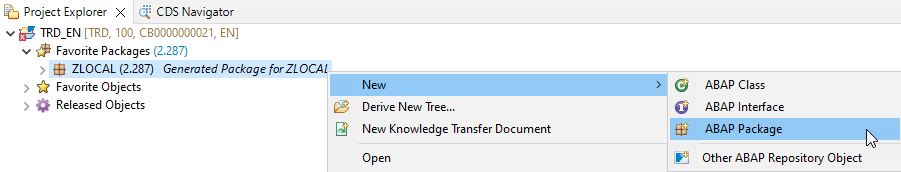
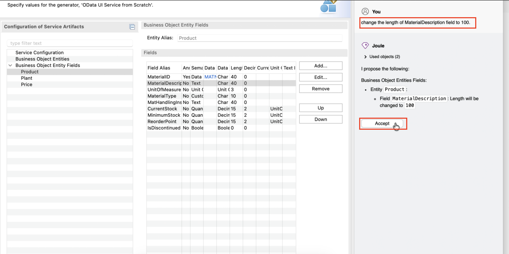
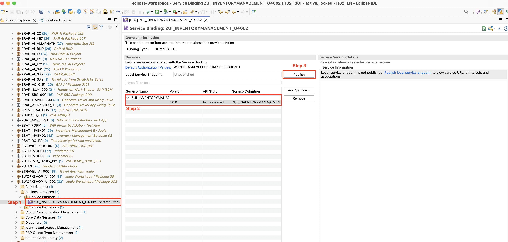
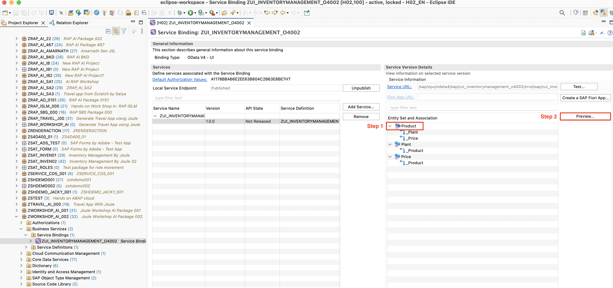

# Exercise: Generate a transactional app from scratch using Joule 💎  

      
## Introduction

In this exercise, you will create a transactional UI service along with the underlying RAP business object to process _Product_ entities.

First, you'll create an ABAP package, a database table, and an ABAP class to populate the database table with demo data. Using **ABAP Cloud Generators: Transactional App from Scratch💎**, you will input a natural language prompt describing the application, and all its artifacts will be generated. This includes the CDS data model, behavior definition, behavior implementation class, service definition, and service binding. After that, you'll publish and check your Smart Inventory application using the SAP Fiori elements preview.

> Refer to the [ABAP Cloud Roadmap Information - GenAI](https://help.sap.com/docs/abap-cross-product/roadmap-info/genai?locale=en-US) for more details.

### Exercises

- [1.1 - Create package](#exercise-11-create-package)
- [1.2 - Generate the transactional UI service](#exercise-12-generate-the-transactional-ui-service)
- [1.3 - Adjust metadata extension](#exercise-13-Adjust-metadata-extension)
- [1.4 - Publish and preview the _Product_ app](#exercise-14-publish-and-preview-the-travel-app)
- [Summary & Next exercise](#summary--next-exercise)

> ℹ️ **Reminder:**
>
> - Don't forget to replace all occurrences of the placeholder **`###`** with your group ID in the exercise steps below.
> - You can use the ADT function **Replace All** (**Ctrl+F**) for the purpose.
> - If you don't have a group ID yet, then check the section [Getting Started - Group ID](../ex0/README.md#group-id) to define a suffix for your artifacts.

## Exercise 1.1: Create package

[^Top of page](#Introduction)

> Create your exercise package **`ZWORKSHOP_AI_###`**.
>
> This ABAP package will contain all the artifacts you will be creating in the different exercises of this hands-on session.

 <details>
  <summary> 🔵 Click to expand!</summary>

1.  In ADT, go to the **Project Explorer**, right-click on the package **`ZLOCAL`**, and select **New** > **ABAP Package** from the context menu.

    


2.  Maintain the required information:

    > Note: **`###`** is your assigned group ID or you can choose your own suffix. Please choose a suitable combination of three (3) numbers and characters, e.g. **`476`** or **`ZT1`**

    - Name: **`ZWORKSHOP_AI_###`**
    - Description: _**`Inventory App Created by Joule ###`**_
    - Select the box `☑️` **Add to favorites package**
    - Superpackage: **`ZLOCAL`**

    Click **Next >**.

    <!--  -->

3.  Select a transport request, maintain a description (e.g. _**Inventory AI App ###**_) if needed, and click **Finish**.

    <!--  -->

</details>

## Exercise 1.2: Generate the transactional UI service

[^Top of page](#Introduction)

> Generate an OData UI service using the ABAP Cloud Generator: Transactional app from scratch 💎

 <details>
  <summary> 🔵 Click to expand!</summary>

1.  Right-click on your ABAP package **`ZWORKSHOP_AI_###`** and select **Generate ABAP Repository Objects** from the context menu.

    Select the entry **OData UI Service from Scratch** in the wizard and click **Next >**.

    Maintain your package name **`ZWORKSHOP_AI_###`** and click **Next >**.

2.  Please copy and paste the prompt provided below in the chat, and press **Enter**. Ensure to replace `###` with your chosen suffix.

    ```PROMPT
    Generate a Inventory Management Application. Follow below instructions. 

    Generate three entities `Product` , `Plant`  and `Price`. 

    The `Product` entity has  fields as below - 
    MaterialID (key, data element MATNR),  MaterialDescription,  UnitOfMeasure,  MaterialType,  MatHandlingInstr, CurrentStock,  MinimumStock, ReorderPoint, IsDiscontinued.  

    The `Plant` entity has   
    Fields -  
    PlantID (key), PlantName, 
    PlantLocation, MaterialID (foregin key)   

    The `Price` entity has  
    Fields -  
    PriceID (key), MaterialID (foreign key),  PreviousPrice, 
    NewPrice, CurrencyCode, ChangeDate, ChangeReason.  

    Establish the relationship between the entities and per the foreign key specified in the properties. The generated objects should end with  suffix “###”
    ```

          
    

3.  Joule will recommend the Business Object entities _Product_, _Plant_ and _Price_ along with their respective fields. Press **Accept**.

    > ℹ️ NOTE: The names of the artifacts, database fields, and other elements in your project may differ from those shown in this tutorial, as they are generated by GenAI
     

    

4.  You can add new fields to the entities either by using the wizard or the chat. We will change the length of `MaterialDescription` filed.
    To do so, copy and paste the prompt provided below, and press **Enter**

    ```PROMPT
       Change the length of MaterialDescription field to 100. 
    ```

5.  Joule will ask to accept the change fields **`MaterialDescription`**. Press **Accept**.

    > 


6.  Click on **Next >**. A preview of the generated objects will appear. Click on **Next >** again, select the transport request, and then click on **Finish**.

8.  Go to the _**Project Explorer**_ view and check all object that have been generated in your package. Press **F5** to refresh your package if needed.

<!--  -->

</details>


[^Top of page](#Introduction)


## Exercise 1.4: Publish and preview the  app

[^Top of page](#Introduction)

> Publish the local service endpoint of your service binding **`ZUI_INVENTORYMANAGEMENT_O4###`** and start the _Fiori elements App Preview_ in ADT.

 <details>
  <summary>🔵Click to expand!</summary>

1.  Go to your service binding **`ZUI_INVENTORYMANAGEMENT_O4###`** and click **Publish** to publish its local service endpoint to view service URL, entity sets, and associations.






2.  Once it is published, select the entity **`Product`** in the **Entity Set and Association** and then click on **Preview**.
3.  The preview of the _Inventoty_ app is now displayed in the browser without any data.

</details>

<!-- ## Exercise 1.5: Create a helper class

[^Top of page](#Introduction)

> Create the ABAP helper class **`ZCL_INVENTORY_HELPER_###`** that will contain common business logic that can be consumed by different business objects and methods - for example, in determinations or validations within our RAP application.
>
> This approach will allow the centralization of unit tests avoiding the need to maintain them within each individual business object.

<details>
  <summary> 🔵 Click to expand!</summary>

1. Right-click on your package **`ZWORKSHOP_AI_###`** and select **New > ABAP Class**

   - Name: **`ZCL_INVENTORY_HELPER_###`**
   - Description: **`Inventory helper class ###`**

2. Copy and paste the following code

   > ℹ️**Reminder**: Don't forget to replace the suffix placeholder **`###`** with your chosen or assigned group ID

   ```ABAP
   CLASS zcl_inventory_helper_### DEFINITION
       PUBLIC
       FINAL
       CREATE PUBLIC .

       PUBLIC SECTION.
       METHODS: validate_inventory IMPORTING iv_customer_id TYPE ZQTY RETURNING VALUE(rv_exists) TYPE abap_bool.
       METHODS: get_xxx IMPORTING iv_status TYPE ZSTATS RETURNING VALUE(rv_status) TYPE status.
       PROTECTED SECTION.
       PRIVATE SECTION.
   ENDCLASS.

   CLASS zcl_inventory_helper_### IMPLEMENTATION.
       METHOD validate_customer.
       
       ENDMETHOD.

      
   ENDCLASS.

   ```

3. Save  and activate  the changes.

</details> -->

## Summary & Next exercise

[^Top of page](#Introduction)

Now that you've...

- Created an ABAP package,
- Generated a SAP Fiori app based on the ABAP RESTful Application Programming model (RAP) from scratch, Just by prompt in natural language. 
- Published a local service point, and started the Fiori elements App Preview in ADT.

---
